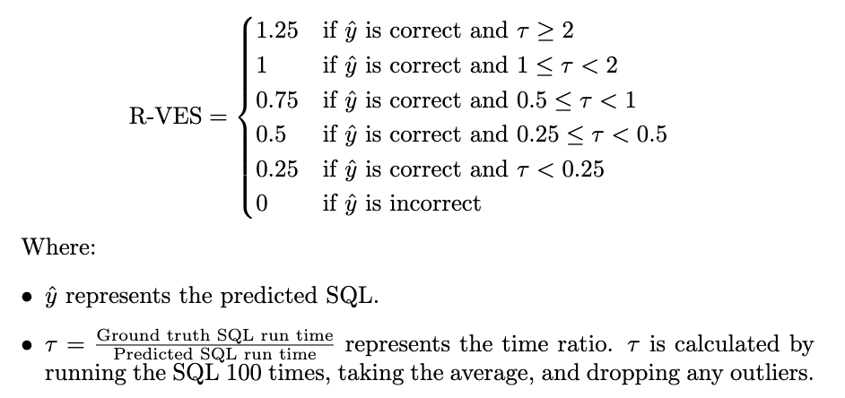
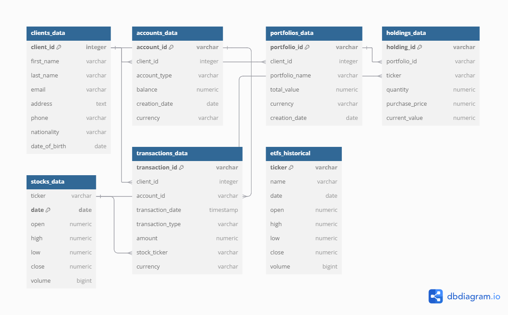

# **VizExplorer**

A **Visual Natural Language Interface (V-NLI)** application designed for intuitive interaction with financial datasets using natural language queries. This project leverages advanced Text-to-SQL techniques, with performance metrics measures trained on the **BIRD** dataset included for evaluation.

---

## **Table of Contents**

1. [Project Overview](#project-overview)
2. [Features](#features)
3. [Folder Structure](#folder-structure)
4. [BIRD Benchmark Results](#bird-benchmark-results)
5. [Additiona Measures](#additional-measures)
6. [Data and Models](#data-and-models)

---

## **Project Overview**

VizExplorer is a **V-NLI application** that enables users to query financial datasets in plain language, automatically translating their input into SQL, executing the query, and visualizing results. The system is optimized for financial analysis tasks and supports database schema generation, and output visualizations.

Link to the application: https://vizexplorer-tool.streamlit.app/

---

## **Features**

- **Natural Language to SQL**: Seamlessly converts natural language queries to SQL.
- **Interactive Interface**: Built with Streamlit for an intuitive user experience. 
- **Performance Metrics**: Logs and evaluates model outputs trained on the **BIRD** dataset with accuracy.
- **Database Management**: Prepares, validates, and executes queries on PostgreSQL and SQLite.

## **Folder Structure**

- **`data/`**:
  - Contains datasets for training, testing, and real-world financial data:
    - `BIRD_dataset/`: Training and evaluation data for the Text-to-SQL task.
    - `Spider_dataset_TEST/`: Tentative of training data with Spider for the Text-to-SQL task.
    - `actual_data/`: Real-world datasets for testing the application.

- **`performance_measure/`**:
  - Contains scripts and charts for evaluating the model's performance:
    - Scripts for metrics like BLEU score, execution accuracy, and R-VES.
    - Visualized charts stored in `performance_measure/graphical_charts/`.

- **`logs/`**:
  - Logs for training and evaluation processes:
    - `evaluation_log.log`: Evaluation details.
    - `training_log.log`: Training progress.

- **`model_output/`**:
  - Stores model predictions:
    - `bird_model_output_formatted.json`: Cleaned and formatted outputs.
    - `bird_model_output.json`: Raw model predictions.

---
## **BIRD Benchmark Results**

**Model Results on BIRD Benchmark:**
- **Exact Match Accuracy**: 0.00%
- **Execution Accuracy**: 25.36%
- **Average R-VES Score**: 0.24

**Comparison with Other Benchmarked Techniques**:

**Execution Accuracy (EX) on PostgreSQL (Mini Dev Set):**

| Rank | Model                  | Code | PostgreSQL |
|------|------------------------|------|------------|
| 1    | TA + GPT-4 (HKU)       | [link](https://github.com/quge2023/TA-SQL) | 50.80      |
| 2    | GPT-4                  | UNK  | 35.80      |
| 3    | GPT-4-32k              | UNK  | 35.00      |
| 4    | GPT-4-turbo            | UNK  | 36.00      |
| 5    | Llama3-70b-instruct    | UNK  | 29.40      |
| 6    | GPT-35-turbo           | UNK  | 27.40      |
| 7    | GPT-35-turbo-instruct  | UNK  | 26.60      |
| **8** | **VizExplorer** | -    | **25.36**  |
| 9    | Phi-3-medium-128k-instruct | UNK  | 21.60      |
| 10    | Llama3-8b-instruct     | UNK  | 18.40      |
| 11   | Mixtral-8x7b           | UNK  | 12.40      |

### Methods of Calculation

#### **1. Execution Accuracy (EX)**
The **Execution Accuracy (EX)** measures the percentage of queries for which the results of the **predicted SQL query** match the results of the **reference SQL query**. The formula is as follows:

**Execution Accuracy (EX) = (Number of Correctly Executed Queries) / (Total Number of Valid Queries)**

- **Correctly Executed Query**: A query whose results (rows and columns) exactly match those of the reference query.
- **Valid Query**: A query that executes without syntax or logical errors.

#### **2. Reward-Based Valid Efficiency Score (R-VES)**
The **R-VES** evaluates query correctness and efficiency by comparing the execution time of the predicted query against the reference query. The formula is as follows:

- R-VES rewards:
  - Both query correctness and efficiency (queries executed faster than the reference query receive higher scores).
---
For more details on the BIRD dataset and benchmarked techniques, visit [BIRD Bench](https://bird-bench.github.io/).

---

## **Additional measures**

### **Quick Overview of Results**
- **Total Queries**: 532
- **Valid Queries**: 422
  - **Valid Reference Queries**: 418 (99.05% of 422 valid queries)
  - **Non-Valid Reference Queries**: 3 (0.71% of 422 valid queries)
  - **Valid Generated Queries**: 222 (52.61% of 422 valid queries)
  - **Non-Valid Generated Queries**: 199 (47.16% of 422 valid queries)
  - **Non-SQL Responses (Out of Scope)**: 110 (20.68% of 532 total queries)

- **Metrics**:
  - **Exact Match Accuracy**: 0.00%
  - **Execution Accuracy**: 25.36% (8)
  - **Average BLEU Score**: 0.07
  - **Average Similarity Score**: 0.58

- **Processing Times**:
  - **Reference Query**: Average 0.01s (Max: 0.2s, Min: 0.0s)
  - **Generated Query**: Average 0.01s (Max: 0.14s, Min: 0.0s)
  - **Average R-VES Score**: 0.24
---
## **Data and Models**

- **Clients Table**:
  - Contains client details such as name, nationality, email, and date of birth.
  - **Source**: This table is **generated** using the `Faker` library with Swiss locales for realistic data.
  - Script: [`clients_data.py`](clients_data.py)

- **Accounts Table**:
  - Stores details of financial accounts, including balances, types (savings, brokerage, etc.), and currencies.
  - **Source**: This table is **generated** using synthetic data linked to the `Clients Table`.
  - Script: [`accounts_data.py`](accounts_data.py)

- **Transactions Table**:
  - Records client transactions (deposits, withdrawals, stock buys/sells), with details such as amounts, currencies, and stock tickers.
  - **Source**: This table is **generated** with predefined transaction patterns linked to the `Accounts Table`.
  - Script: [`transactions_data.py`](transactions_data.py)

- **Portfolios Table**:
  - Maintains portfolios linked to clients, with portfolio names, types (e.g., Balanced Growth, High-Yield Income), total value, and currency.
  - **Source**: This table is **generated** based on client data from the `Clients Table`.
  - Script: [`portfolios_data.py`](portfolios_data.py)

- **Holdings Table**:
  - Tracks securities (stocks, ETFs) held within client portfolios, with details such as quantity, purchase price, and current value.
  - **Source**: This table is **generated**, linking portfolios from the `Portfolios Table` and securities from the `Stocks and ETFs`.
  - Script: [`holdings_data.py`](holdings_data.py)

- **Stocks**:
  - Historical price data for stocks such as AAPL, MSFT, and TSLA.
  - **Source**: The data is fetched using the **StockData.org API**.
  - Script: [`stocks_data.py`](stocks_data.py)

- **ETFs**:
  - Historical price data for ETFs such as SPDR S&P 500 (SPY) and Vanguard Total Stock Market ETF (VTI).
  - **Source**: The data is fetched using the **Financial Modeling Prep API**.
  - Script: [`etf_data.py`](etf_data.py)

## **Logs and Visualizations**
- **Logs**:
  - Location: `logs/`
  - Files: `evaluation_log.log`, `training_log.log`

- **Visualizations**:
  - BLEU Score Distribution
  - Execution Accuracy Breakdown
  - Processing Time Comparison
  - Similarity Score Distribution
  - Query Validation Breakdown
  - Visualized charts saved in `performance_measure/graphical_charts/`.

- **Scripts**:
  - Location: `performance_measure/`
  - Scripts for performance metrics calculation and visualizations.
