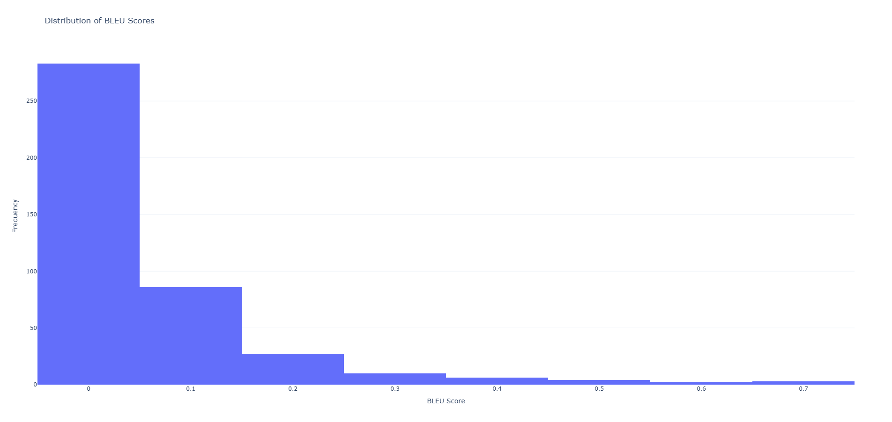
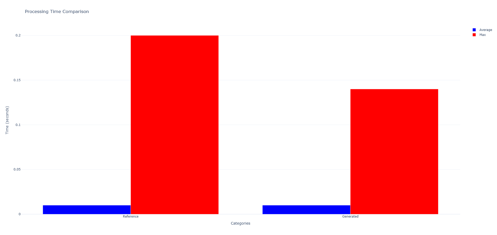
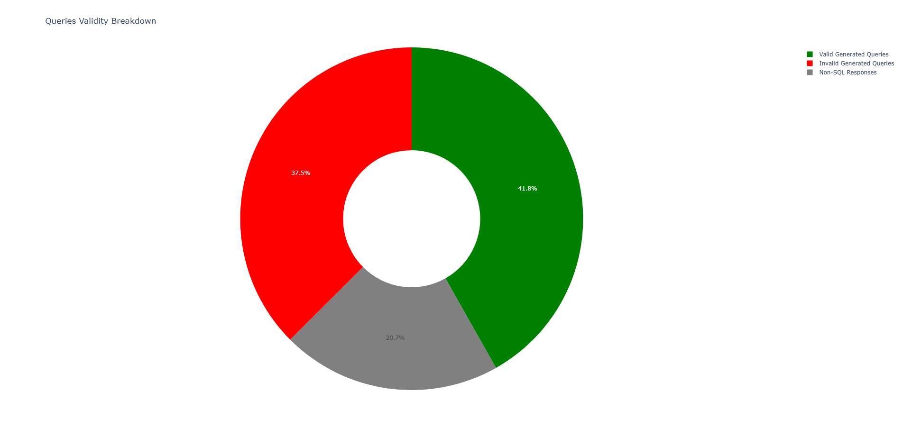
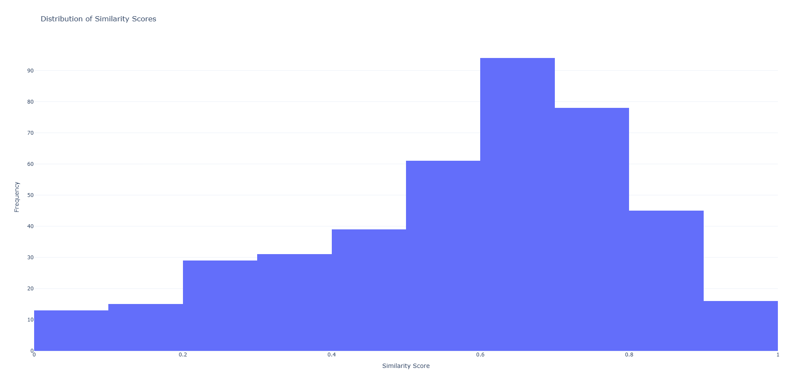

# Performance Metrics Analysis

### Summary of Results

- **Total Queries**: 532
- **Valid Queries**: 422
  - **Valid Reference Queries**: 418 (99.05% of 422 valid queries)
  - **Non-Valid Reference Queries**: 3 (0.71% of 422 valid queries)
  - **Valid Generated Queries**: 222 (52.61% of 422 valid queries)
  - **Non-Valid Generated Queries**: 199 (47.16% of 422 valid queries)
- **Non-SQL Responses (Out of Scope)**: 110 (20.68% of 532 total queries)

- **Exact Match Accuracy**: 0.00%
- **Execution Accuracy**: 25.36%

---

### BLEU Scores and Processing Times

| Metric                      | Average | Min   | Max   |
|-----------------------------|---------|-------|-------|
| **Similarity Score**        | 0.58    | 0.0   | 0.97  |
| **BLEU Score**              | 0.07    | 0.0   | 0.72  |
| **Processing Time (Reference)** | 0.01s   | 0.0s  | 0.2s  |
| **Processing Time (Generated)** | 0.01s   | 0.0s  | 0.14s |

---

### Most Common Errors in Generated Queries

1. **Error**: `column q.driverid does not exist`
   - Occurrences: 6
   - **Details**:
     ```
     LINE 3: JOIN drivers d ON q.driverId = d.driverId
                                  ^
     HINT: Perhaps you meant to reference the column "q.driverId".
     ```

2. **Error**: `division by zero`
   - Occurrences: 5

3. **Error**: `column t.gasstationid does not exist`
   - Occurrences: 5
   - **Details**:
     ```
     LINE 3: JOIN public.gasstations g ON t.GasStationID = g.GasStationID
                                         ^
     ```

4. **Error**: `syntax error at or near "The"`
   - Occurrences: 4
   - **Details**:
     ```
     LINE 1: The provided context IS insufficient TO generate the SQL que...
             ^
     ```

5. **Error**: `relation "public.transactions_1k" does not exist`
   - Occurrences: 3
   - **Details**:
     ```
     LINE 2: FROM public.transactions_1k t
                 ^
     ```

---

## Visualizations

### BLEU Score Distribution


### Processing Time Comparison


### Queries Validation Breakdown


### Similarity Score Distribution


```markdown